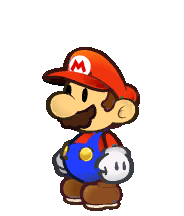
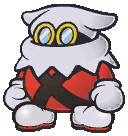
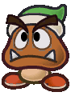

# Paper Mario - Remake | Functional Specifications

Table of Contents

- [Paper Mario - Remake | Functional Specifications](#paper-mario---remake--functional-specifications)
  - [1. Project Overview](#1-project-overview)
  - [2. Functional Requirements](#2-functional-requirements)
    - [2.1 Overview](#21-overview)
    - [2.2 Details](#22-details)
      - [2.2.1 Movements](#221-movements)
      - [2.2.2 NPCs](#222-npcs)
        - [2.2.2.1 Passive NPCs](#2221-passive-npcs)
        - [2.2.2.2 Aggressive NPCs](#2222-aggressive-npcs)
      - [2.2.3 Characters](#223-characters)
      - [2.2.4 Attributes](#224-attributes)
      - [2.2.5 K.0](#225-k0)
      - [2.2.6 Map](#226-map)
      - [2.2.7 Stopped by the teacher](#227-stopped-by-the-teacher)

## 1. Project Overview

Paper Mario - Remake is a mix between the 2D of Super Paper Mario and the turn-based combat of Paper Mario: The Thousand-Year Door. The game is therefore based on 2D, with graphics from Paper Mario: The Thousand-Year Door and its turn-by-turn gameplay.

This project is coded in C++, although some implementations can be made in C.

The aim of this project is to learn the C++ programming language and to understand what an object-oriented programming (OOP) language is.

## 2. Functional Requirements

### 2.1 Overview

The aim is to have a working version of the game at the end of the project. Basic functions such as movement and animations are implemented and functional. Collisions and combat with monsters should also be implemented, even if not all the combat features are present.

### 2.2 Details

#### 2.2.1 Movements

Using the defined keys, the main character must be moveable and must have a hitbox. He must be able to move around using the keys on his keyboard (Keyboard arrows and keys).

The character must be fluid, and not have any problems with sprites being displayed out of order, continuously, or in the wrong direction.

NPCs (Non-player characters) must move randomly from left to right, but must follow a set movement time, also defined randomly. NPCs are given a specific direction for a specific amount of time, and once this direction has been completed, another specific amount of time is randomly assigned to move the NPC in the opposite direction.

#### 2.2.2 NPCs

There are two types of NPC: passive NPCs and aggressive NPCs.

##### 2.2.2.1 Passive NPCs

Passive NPCs can generally be found in towns. You need to be able to communicate with them by pressing a key on your keyboard, or simply continue on your way.

NPCs should be in the background, with the main character taking the lead in terms of sprites.
They must be stable and never change location (if no movement has been coded).

NPCs don't give you any experience points or assets (extra life, faster movement, etc.). The only things they can give are items (weapons, for example), or clues to the next stage of the adventure.

The NPCs need to have a hitbox bigger than them so that we can interact with them from a few dozen pixels away.

##### 2.2.2.2 Aggressive NPCs

Aggressive NPCs can be found outside towns and/or at night, where they are also more numerous. They can also be found in special buildings.

They have a hitbox equal to the size of their sprite, so that collisions are precise and the user has to be careful not to start a fight when they come into contact with them.

If the user makes contact from any side (top, left, right) they automatically enter combat with the mob(s). 

Aggressive mobs must give variable experience points depending on the difficulty of the fight (number of mobs), the amount of experience they have and the level of the main character.

Let's imagine we have 3 characters who each give 3 XP. If the main character is above level 3 :
- He will receive 0 XP per mob, and the entire fight will give him 1 XP.

However, if the character is below level 3, he will gain XP from the mobs, by subtracting the main character's level and adding 1.

For example: 
- We have 3 characters giving 3 XP and the main character is level 2, then we'll get (3 XP - 2 XP) + 1, giving a total of 2 XP/mobs. The entire fight will therefore give 6 XP.

#### 2.2.3 Characters

| Picture | Name | Description | Status |
|---|---|---|---|
|  | Mario | Mario is the character embodied by the user. He is the protagonist of the story. He can move, jump, hammer and interact with the Passive NPCs and nature. | Playable |
|  | Aggressive NPCs | Aggressive NPCs are designed to knock Mario out during combat phases using various types of attack. | Aggressives |
|  | Passive NPCs | Mario can interact with Passive NPCs via dialogue. These same characters can give items to Mario. | Passives |

#### 2.2.4 Attributes

The main character has several attributes. We have its number of life points, its number of flower points, its number of experience as well as its number of pieces (called Kamas).

When the character is moving, the game is full screen, with no information displayed. However, if the user no longer moves, a bar is displayed at the top of their screen indicating the attributes mentioned above.

During a fight, Mario's attributes can change. The attributes remain set to the last value they had.

For example, if Mario loses 1 life point during a fight, he will always have 1 life point less even outside of the fight, until Mario then decides to feed himself with an item, receiving as a reward the from an NPC or by purchasing from an NPC using Kamas.

Each time Mario obtains 100 experience in total, he moves to the next level allowing him to improve one of 3 different attributes:
- Increase his number of flower points by 5 points 
- Increase his number of flower points by 5 points
- Increase his badge points number by 3 points

#### 2.2.5 K.0

During a fight, if Mario reaches 0 life points, he becomes K.0 and in this case, Mario returns to the last saved save. He therefore does not restart the game from 0.

#### 2.2.6 Map

The game will use the basic maps of Paper Mario: The Thousand-Year Door given that we do not have the time or the necessary means to create maps. The objective is to have several functional maps, which can help form a story.

#### 2.2.7 Stopped by the teacher